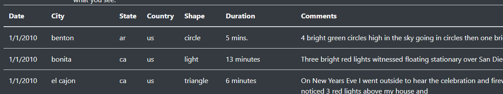
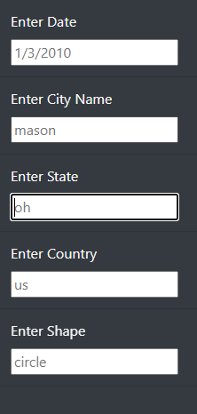
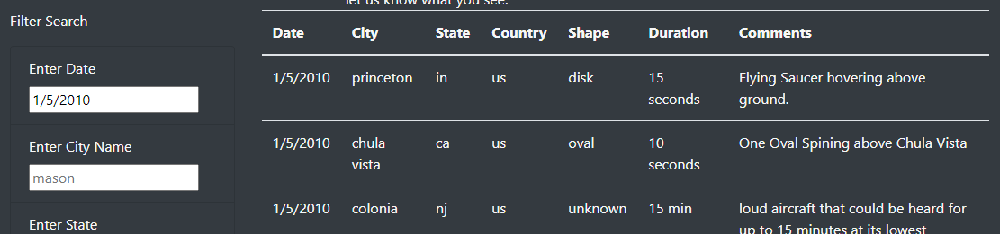
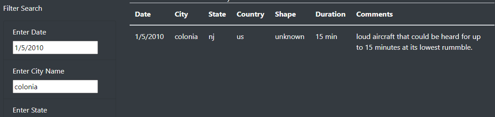

# UFO Sighting Website
## Overview of Analysis

### The purpose of this project was to create a UFO sighting website. The site would display what the website was for and include a table of sighting data the user could view and filter.

## Webpage Explanation

### In this project we built a web page for people interested in UFO sightings. This webpage explains it's purpose and allows users to analyze a set of UFO sighting data. Here I will explain what the website looks like and how it works.
Like any standard web page, this web page includes the Name of the page, an image, and a brief description of what the site is for. But, what makes this site special is it provides actual UFO sighting information, in a table, right on the page.   Not only that, the user can filter the data in that table based on several different criteria, including: Date, City, State, Country, and UFO Shape. The process for this filtering is very simple. Just enter the value you want to filter a column to in the appropriate field to the left of the table. 

You can see an example of what the value being entered should look like displayed in each of the fields. Once you've entered a value, either, hit the "Tab" or "Enter" key, or click somewhere else on the page. The data in the table will then filter so it's only showing the desired data. You can also filter by more then one field at a time. 

## Summary

  I believe what we came up with is a good website that does what was desired. But, I also believe it can be better. One drawback to the current website is that the data is static. We should find a a way to update the dataset in the table with new data, either by scraping it from somewhere online and having it added to the data.js file, or adding data to that file manually. The site could also be updated to add a keyword search for for the "comments" field. Maybe even the abiltiy to filter one field by two possible things, for example city by Benton or Bonita. It would also be more user friendly if the filters were not case sensative. As stated earlier this website is agood start, and we should keep updating it to make it even better. 

